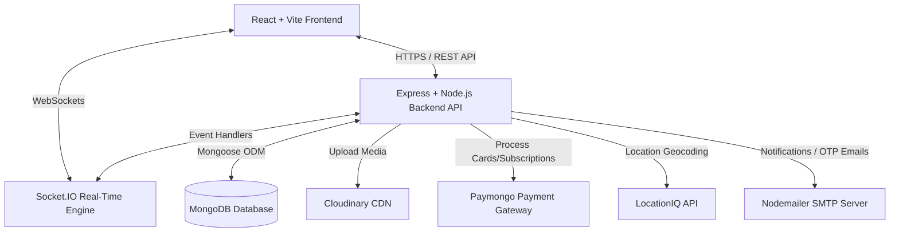
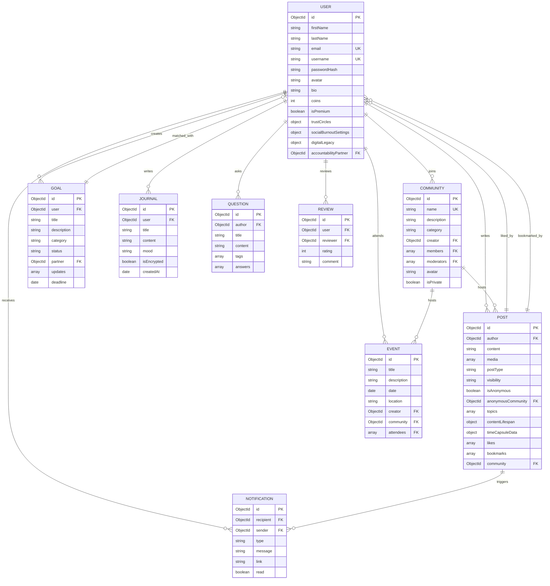
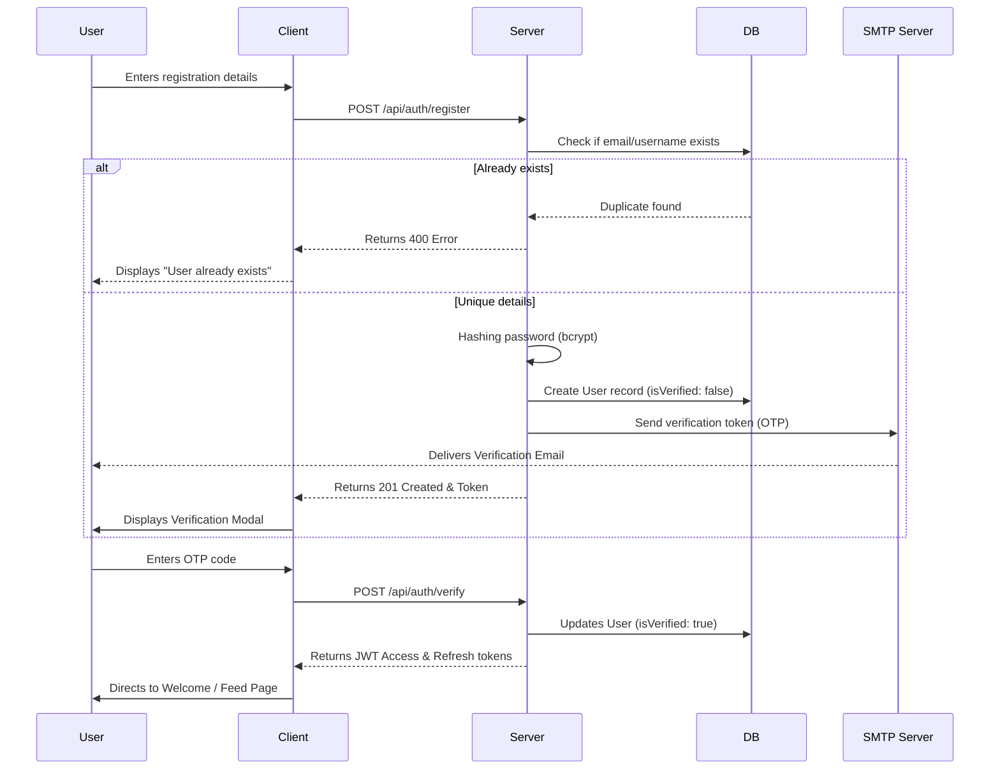
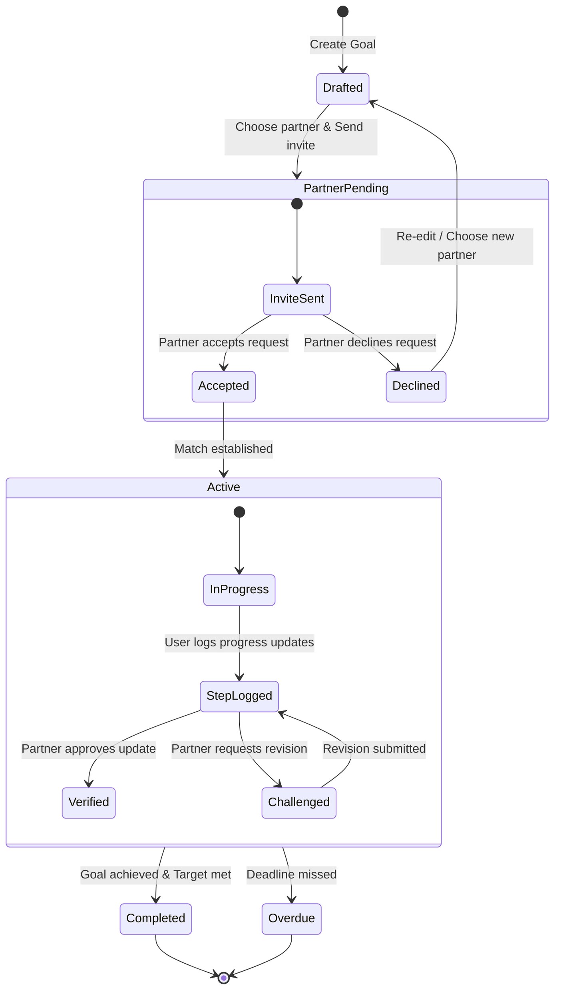

# Connectify - System Design & Architecture

This document provides a comprehensive technical overview of **Connectify**, including its system architecture, data models, entity relationships, use cases, and business process flows.

---

## 1. System Architecture

Connectify follows a **micro-monolith architecture** using a robust full-stack Javascript design:



### Components Summary:
- **Frontend**: Single Page Application built on React, Vite, and Framer Motion. Uses Axios for API communications and Socket.io-client for real-time channels.
- **Backend API**: Node.js and Express server routing endpoints for authentication, post creations, goals, communities, and payments. Secured using Helmet, CORS, and rate limiting middleware.
- **Real-Time Engine**: Built on Socket.IO, sending notifications, tracking active user status, and broadcasting chat/event alerts.
- **Database**: MongoDB serving documents, indexes, and aggregation pipelines.
- **CDNs & APIs**:
  - **Cloudinary**: Stores and optimizes user-submitted media (avatars, portfolio images, post videos).
  - **Paymongo**: Processes test credit card payments for premium subscriptions.
  - **LocationIQ**: Resolves user location input into clean geographical names and coords.
  - **Nodemailer**: Dispatches verification pins and Digital Legacy contact request templates.

---

## 2. Entity Relationship Diagram (ERD)

The database schema is managed using Mongoose. The diagram below documents the collections, key fields, and associations:



---

## 3. System Use Cases

Connectify's interaction scope is divided into core social mechanics and our 5 unique platform offerings:

```mermaid
usecaseDiagram
    actor "Registered User" as user
    actor "Legacy Trustee" as trustee
    actor "System / Chron Job" as system

    package "Connectify Social Suite" {
        usecase "Share Post to Feed" as UC_Feed
        usecase "Manage Trust Circles" as UC_Circles
        usecase "Doomscroll / Wellbeing Controls" as UC_Wellbeing
        usecase "Establish Accountability Goal" as UC_Goal
        usecase "Spin Up Disposable Profile" as UC_Disposable
        usecase "Set Digital Legacy Trustee" as UC_LegacySetup
        usecase "Claim Legacy Assets" as UC_LegacyClaim
    }

    user --> UC_Feed
    user --> UC_Circles
    user --> UC_Wellbeing
    user --> UC_Goal
    user --> UC_Disposable
    user --> UC_LegacySetup

    trustee --> UC_LegacyClaim
    system --> UC_LegacyClaim
```

### Use Case Specifications:
1. **Manage Trust Circles**: A user restricts visibility of a post to a custom group (e.g. `Friends` or `Coworkers`). Only users listed under the respective arrays in the author's Mongoose model can access or view the content in their feed queries.
2. **Doomscroll / Wellbeing Settings**: A user enables *Like-Free Mode* and *Slow Feed*. The client intercepts these variables from the context, globally masking like counters and disabling the refresh spinner after the feed threshold is reached. It updates server-side screen time using a keep-alive background socket.
3. **Spin Up Disposable Profile**: A user chooses to post in a sensitive community anonymously. The system issues a temporary sub-profile containing random usernames and placeholder icons, mapping posts to this avatar and setting an automated TTL (Time to Live) index for expiration.
4. **Claim Legacy Assets**: If a user's account remains inactive past the inactivity delay, the system triggers notifications. Alternatively, a designated Trustee can upload verification details to request account memorialization or data deletion.
5. **Establish Accountability Goal**: Users post goals and invite a partner. The partner verifies updates, receiving Socket notifications when steps are logged or missed.

---

## 4. Business Process Flows

### 4.1 Onboarding & Email Verification


### 4.2 Accountability Goal Lifecycle


### 4.3 Digital Legacy Claim Flow
```mermaid
flowchart TD
    Start[User account goes inactive for 180 days] --> CheckLegacy{Is Digital Legacy enabled?}
    CheckLegacy -- No --> Archive[Account archived under standard inactive policy]
    CheckLegacy -- Yes --> NotifyTrustee[System emails designated legacy contact]
    
    NotifyTrustee --> ClaimSubmit[Legacy contact submits verification info]
    ClaimSubmit --> Validate{System verifies claims}
    
    Validate -- Denied --> AlertSecurity[Security flag raised; owner notified]
    Validate -- Approved --> ExecutePolicy{Action policy set by User}
    
    ExecutePolicy -- Memorialize --> Memo[Freeze profile; mark as Memorialized]
    ExecutePolicy -- Delete --> DelData[Permanently scrub all user posts & data]
    ExecutePolicy -- Transfer --> TransferAcc[Deliver access credentials to contact]
    
    Memo --> End[Flow Complete]
    DelData --> End
    TransferAcc --> End
